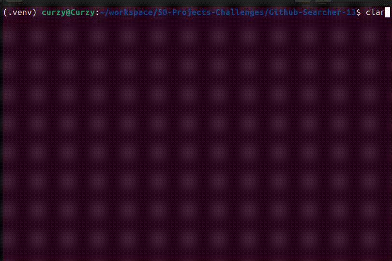

<h1 align="center">GitHub Searcher</h1>
<p align="center">
  <strong>Asynchronous GitHub Repository & Code Scanner CLI</strong>
</p>

<div align="center">

[](https://github.com/Curzyori/github-searcher/stargazers)
[](https://github.com/Curzyori/github-searcher/network/members)
[](LICENSE)
[](#)

</div>

<p align="center">
  <a href="#-why-github-searcher">Why This</a> ·
  <a href="#-key-features">Features</a> ·
  <a href="#-tech-stack">Tech Stack</a> ·
  <a href="#-quick-start">Quick Start</a>
</p>

---

## 🕒 Why GitHub Searcher?

Searching code or repositories at scale on GitHub is often blocked by API rate limits (HTTP 403) and complex authentication requirements when deep-scanning thousands of files.

GitHub Searcher solves this with a **Dual-Engine Architecture**:

| Engine | Mode | How It Works |
| :------ | :--- | :--- |
| **Auto Pilot** | Browser Session | Simulates browser sessions using cookies (`GITHUB_SESSION`) to scrape GitHub search UI |
| **Fast Skip** | Direct Token | Uses personal access token (`GITHUB_TOKEN`) for fast API queries |

---

## 🎯 Key Features

| Feature | Status | Description |
| :--- | :---: | :--- |
| **Dual Engine Mode** | ✅ | Auto Pilot (Session) & Fast Skip (API Token) |
| **Search Repositories** | ✅ | Mass extract GitHub repository lists with structured output |
| **Search Code** | ✅ | Scan source code in selected repos for specific strings or tokens |
| **Async Batch Scanning** | ✅ | Process 5 repositories simultaneously for maximum speed |
| **Interactive 2FA/OTP** | ✅ | Two-Factor Authentication support directly from terminal |
| **Auto Session Saving** | ✅ | Automatically saves session cookies to `.env` after login |

---

## 🛠️ Tech Stack

| Technology | Why |
| :--------- | :-- |
| **Python (Asyncio)** | Non-blocking I/O for superior async search performance |
| **HTTPX** | Modern HTTP client for async requests and session cookies |
| **BeautifulSoup4** | Parse HTML from GitHub search results in Auto Pilot mode |
| **Aiofiles** | Async file writing without blocking the program |
| **Python-dotenv** | Dynamic `.env` configuration management |

---

## 🚀 Quick Start

### Prerequisites
- Python 3.8+
- GitHub account (for Auto Pilot mode)
- GitHub Personal Access Token (for Fast Skip mode)

### 1. Clone Repository

```bash
git clone https://github.com/Curzyori/github-searcher.git
cd github-searcher
```

### 2. Install Dependencies

```bash
pip install -r requirements.txt
```

### 3. Setup Environment Variables

```bash
cp .env.example .env
```

Edit `.env` with your credentials:

```env
GITHUB_TOKEN=ghp_your_token_here
GITHUB_SESSION=cookie_user_session_auto_filled
```

### 4. Run Application

```bash
python main.py
```

---

## 📖 Usage

### Selecting Execution Mode

```
1. Auto Pilot  -> Browser Session (.env Session)
2. Fast Skip   -> Direct Token (GITHUB_TOKEN)

[?] Select Execution Mode [1/2]:
```

- **Mode 1 (Auto Pilot):** Login with GitHub credentials (email, password, 2FA if enabled). Session auto-saved.
- **Mode 2 (Fast Skip):** Use pre-configured GitHub Token from `.env`.

### CLI Menu

- **Menu 1:** Search repositories — enter keywords and number of pages to extract
- **Menu 2:** Search code — enter keywords (function names, APIs, secret tokens) and file extension filters

---

## 🖼️ Preview

<table align="center">
  <tr>
    <td align="center"><b>CLI Demo</b></td>
  </tr>
  <tr>
    <td></td>
  </tr>
</table>

---

## 🗺️ Roadmap

- [ ] Fix **CODE SEARCH** feature in **Mode 1 (Auto Pilot)**
- [ ] Proxy rotation support to avoid IP rate-limits in Auto Pilot mode
- [ ] Custom regex pattern selector from CLI menu
- [ ] Export search results to JSON and CSV formats

---

## 📄 License

Released under the **MIT License** — Copyright (c) 2026 @Curzyori & @Seeyaa77.

---

## 🤝 Collaboration

Built as a collaboration project between **@Curzyori** and **@Seeyaa77**.

---

<sub>Built with passion as the 13th Project of the <strong>50 Projects Challenge</strong> by <strong>@curzyori</strong></sub>
